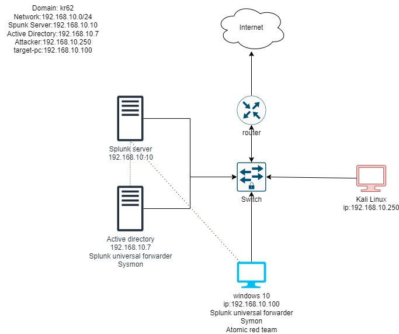

# Active Directory and Security Lab Setup

## Introduction

This project involves setting up a comprehensive lab environment to simulate real-world cybersecurity scenarios. The goal was to gain hands-on experience with Active Directory, security monitoring, and automation tools. The lab includes the configuration of multiple virtual machines, installation of security tools, and running security tests, all within a controlled environment. This project has greatly enhanced my understanding of network security, endpoint monitoring, and Active Directory management.

# Active Directory and Security Lab Setup

## Skills Acquired

During this project, I acquired and refined the following skills:

1. **Virtual Machine Setup**: Configured virtual machines using Oracle VM VirtualBox, including Windows 10, Kali Linux, Windows Server, and Ubuntu Server.
2. **Network Configuration**: Set up IP addresses and NAT Networks for seamless communication between VMs.
3. **Troubleshooting**: Diagnosed and resolved network connectivity issues, including DNS and ping failures.
4. **Security Tools Installation**: Installed and configured Splunk Server, Splunk Universal Forwarder, and Sysmon for endpoint monitoring.
5. **Security Testing**: Conducted brute force attacks using Crowbar and simulated adversarial techniques with Atomic Red Team (ART).
6. **Log Analysis**: Analyzed security logs within Splunk, focusing on event codes 4625 and 4624.
7. **Active Directory Management**: Joined Windows machines to a domain and enabled Remote Desktop.
8. **PowerShell Scripting**: Automated tasks using PowerShell, including setting execution policies and making web requests.

These skills have provided me with a solid foundation in virtualization, networking, security tools, and Active Directory management.

## Tools Utilized

- **Oracle VM VirtualBox**: Managed multiple virtual machines for the lab environment.
- **Splunk**: Used for comprehensive log analysis and monitoring.
- **Sysmon**: Deployed for detailed endpoint monitoring on Windows machines.
- **Crowbar**: Utilized to simulate brute force attacks against systems.
- **Atomic Red Team (ART)**: Employed to conduct security tests and validate defenses.
- **PowerShell**: Scripted automation tasks and configurations.

## Lab Setup and Procedure

### 1. Virtual Machine Configuration

- **Windows 10 and Kali Linux Setup**: Created and configured VMs in Oracle VM VirtualBox.
- **Network Configuration**: Set up static IPs and NAT Networks for all VMs.
- **Windows Server Installation**: Deployed Windows Server for domain control and management.

### 2. Installing Security Tools

- **Splunk Server**: Installed on Windows Server for centralized log management.
- **Sysmon Deployment**: Configured on Windows machines for enhanced endpoint monitoring.
- **Crowbar Installation**: Set up on Kali Linux for brute force attack simulations.

### 3. Active Directory Configuration

- **Domain Joining**: Connected Windows 10 machines to the Active Directory domain.
- **Remote Desktop Activation**: Enabled and tested Remote Desktop connectivity.

### 4. Security Testing with Atomic Red Team

- **Simulating Attacks**: Used ART to run security tests, identifying gaps in defenses.
- **Log Analysis in Splunk**: Monitored and analyzed security events generated by ART.

## Conclusion

This project provided invaluable practical experience with Active Directory and security tools within a controlled lab environment. By setting up and managing this lab, I gained deeper insights into cybersecurity concepts and practices, which will significantly benefit my future endeavors.

### Acknowledgments

Special thanks to the various online resources and tutorials that guided me through this process, particularly the MyDFIR YouTube channel for its comprehensive tutorials on lab setups and security testing.
